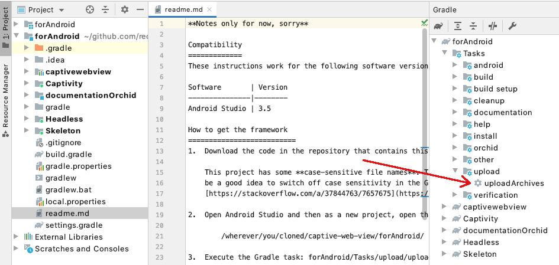

# Custom Keyboard for Android
This directory is for the proof-of-concept custom keyboard for Android.

# Build Instructions
These instructions have been tested with version 4.1.1 of Android Studio.

-   There is a dependency on the library for Android in the captive-web-view
    submodule. Build the dependency first, as follows.

    1.  Open Android Studio.
    2.  Close any open projects, to avoid accidents.
    3.  Open as an existing project this location:

            /where/you/cloned/redash/captive-web-view/forAndroid/
        
        Note: Don't select any file under that directory.
    
    4.  Android Studio prompts you to Gradle Sync because it is unable to get
        Gradle wrapper properties. Select OK and the project will build.
    
    5.  Execute the Gradle task: forAndroid/Tasks/upload/uploadArchives

    The following screen capture shows the default location of the option.

    

    That should create a maven repository under the directory:
    `/where/you/cloned/redash/captive-web-view/m2repository/`

    The repository will contain the dependency and it can be included in the
    custom keyboard project.

-   To build the keyboard itself:

    1.  Open Android Studio.
    2.  Close any open projects, to avoid accidents.
    3.  Open as an existing project this location:

            /where/you/cloned/redash/Keyboard/forAndroid/
        
        Note: Don't select any file under that directory.
    
    4.  Android Studio prompts you to Gradle Sync because it is unable to get
        Gradle wrapper properties. Select OK and the project will synchronise
        and configure its build. It might take a minute or two first time.

-   To install the keyboard via adb, execute the Gradle task:  
    DasherKeyboard/Tasks/install/installDebug

    Gradle tasks can be accessed from the Gradle assistant tab sidebar, which
    by default is at the top right of the Android Studio window.

-   To make the Dasher keyboard available on a device or simulator:

    1.  Open Android settings on the device, for example by swiping down from
        the top of the screen and then tapping the cog icon.
    2.  Search for 'Virtual Keyboard'.
    3.  Tap 'Manage keyboards' and enable the 'Dasher Keyboard'.

-   You can switch to the Dasher custom keyboard by:

    1.  Tapping in a text field to cause the keyboard to be presented.
    2.  Tap the keyboard icon in the bottom right corner.
    3.  Select 'Dasher Keyboard' in the alert.

# License
Copyright (c) 2020 The ACE Centre-North, UK registered charity 1089313.  
MIT licensed, see
[https://opensource.org/licenses/MIT](https://opensource.org/licenses/MIT).
