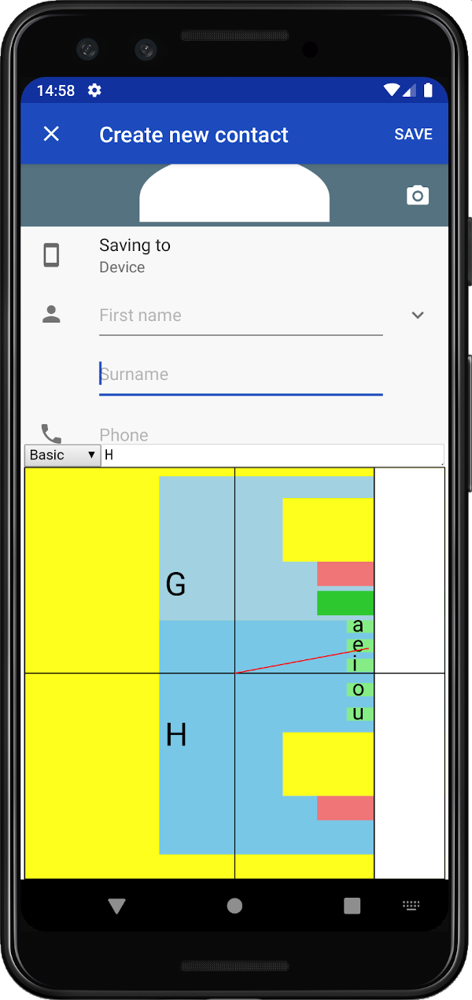
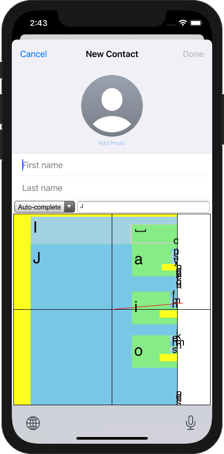
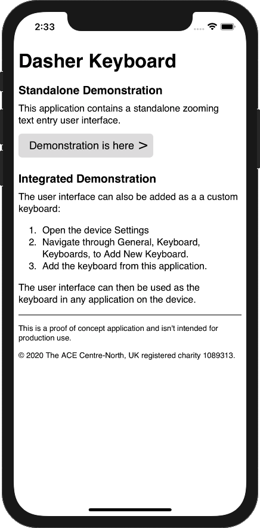
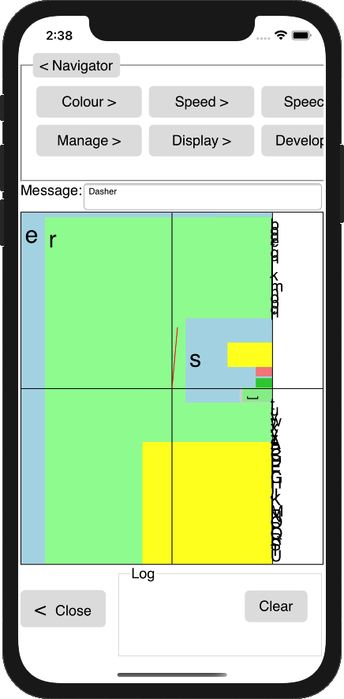

# Screen Capture Images
This directory has screen captures of Dasher Version Six.

# Custom Keyboard for Android
The following screen capture shows the Dasher Version Six custom keyboard for
Android. The keyboard is running in the vanilla Contacts app.

Code for the custom keyboard for Android is in this repository. See:
[../../Keyboard/forAndroid/](../../Keyboard/forAndroid/)

# Custom Keyboard for iOS
The following screen capture shows the Dasher Version Six custom keyboard for
iOS. The keyboard is running in the vanilla Contacts app.

The keyboard has access to the device's predictive text capability.

Code for the custom keyboard for iOS is in this repository. See:
[../../Keyboard/foriOS/](../../Keyboard/foriOS/)

# Standalone App for iOS
Custom keyboards for iOS must be packaged in an app, as an extension. This means
that there has to be a standalone app for iOS, as a host for the custom
keyboard.

The following screen capture shows the first screen in the standalone app. It is
like an About screen.

The following screen capture shows the second screen in the standalone app. It
is an embedded web view running the Dasher Version Six user interface.

Features like speech are available, as they are in the browser version. The
standalone app, like the custom keyboard for iOS, has access to the device's
predictive text. The app can be used offline, because the HTML, CSS, and
JavaScript files are packaged as app resources.

Code for the standalone app is in this repository, in the same location as the
custom keyboard for iOS, above.

# Document Information
This content is part of the Dasher project and is under revision control here:  
[https://github.com/dasher-project/redash](https://github.com/dasher-project/redash)

(c) 2020 The ACE Centre-North, UK registered charity 1089313.  
MIT licensed, see [https://opensource.org/licenses/MIT](https://opensource.org/licenses/MIT)
