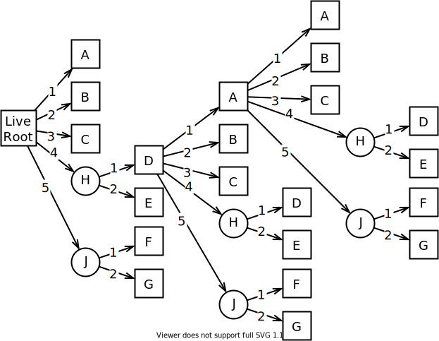
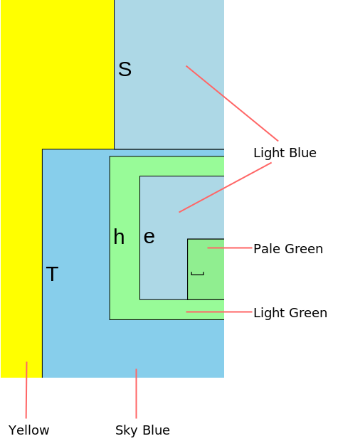
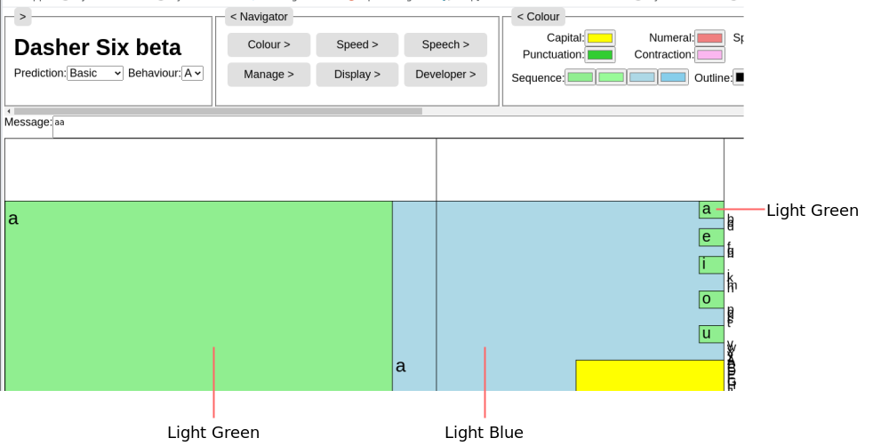

# Zoom Box Palette
This document is part of the Dasher Version Six Specification. It introduces the
zoom box palette. The palette sets the order of boxes and their structure within
the zoom box hierarchy. It is utilised in spawning, which is discussed later in
the specification.

Some terms used here are defined in earlier parts of the specification. See the
[previous section](../04ZoomingSolver/ZoomingSolver.md) of the specification,
and the [table of contents](../).

# Palette
The order and structure of zoom boxes in the hierarchy is determined by a zoom
box **Palette**. The palette is a hierarchical tree structure with:

-   Child, parent, and sibling relationships between nodes, similar to the zoom
    box hierarchy as described earlier in the specification.

-   A single root node, referred to as the **Palette Root**.

-   Zero or more **Group** nodes. Each group node is either a child of the
    palette root, or the child of another group node. Each group node has a
    number of child nodes. Group nodes are never leaf nodes.

-   One or more **Principal** nodes. Each principal node is either a child of
    the palette root, or a child of a group node. Principal nodes don't have
    child nodes. Principal nodes are always leaf nodes. All leaf nodes in a
    palette hierarchy are principal nodes.

The child nodes of a node are ordered in the palette.

A zoooming user interface could in principle have multiple palettes and the user
could select which to use. Multiple palettes could improve support for
internationalisation and languages, for example. There is only one palette in
the Dasher Version Six proof-of-concept implementation. The palette is suitable
for English language text entry. It has approximately seventy principal nodes
and five group nodes.

## Role of the Palette
The zoom box palette determines the following.

-   Structure of the zoom box hierarchy.
-   Order of child boxes in a parent box.
-   Colour of zoom box rectangles in the hierarchy.
-   Which texts will always appear as incremental texts, in every level of the
    hierarchy.

For example, the following are part of the palette in the Dasher Version Six
browser proof-of-concept.

-   Capital letters are a group contained by a parent box.
-   Small letters appear in alphabetic order, before the capital group.
-   The rectangle of the capitals group box is yellow, by default.
-   The currency sign for pounds sterling appears in every level of the
    hierarchy.

The zoom box palette doesn't determine, for example, the relative size of boxes
in the hierarchy. That is determined by the language prediction model and other
factors that are outside the palette. Those factors are discussed later in the
specification.

Although texts that are in the palette will be present in every level of the
hierarchy, their zoom boxes may at times be too small to render. This depends on
the zooming interaction, controlled by the user, and on the relative size
determination factors.

Note that texts that aren't in the palette can still be present as
incremental texts in the zoom box hierarchy.

It looks like the Dasher Version Six proof-of-concept doesn't support the
inclusion of texts that are outside the palette.

## Palette Diagram
The following diagram shows a zoom box palette with the following
nodes.

-   Palette Root.
-   Principal nodes, A to G.
-   Group nodes, H and J.

<picture>
    <source
        media="(prefers-color-scheme: dark)"
        srcset="PaletteHierarchy_exported-dark.svg" >
    
</picture>

Node paths are numbered from one in the diagram. Index values are zero-based in
the code.

Note that this is a very simple palette for the purposes of illustration. The
palette in the Dasher Version Six proof-of-concept has about seventy principal
nodes and five group nodes.

# Hierarchy Correspondence
The live zoom box hierarchy in the user interface will follow the structure of
the palette. Where the palette hierarchy reaches a leaf node but the live
hierarchy doesn't, the palette hierarchy will be repeated. The live zoom box
will then take the place of the palette root in the repetition.

The palette hierarchy is static, both in order and in depth. If a zooming user
interface supported multiple palettes, then each would be static. The live zoom
box hierarchy has static order, but dynamic depth. New levels can be added, and
existing levels can be removed.

A live zoom box can be described as having a **correspondence** with a palette
node that is in the same position in the hierarchy.

In the case that the palette hierarchy is repeated, the zoom box at the root of
the repetition could in theory be said to have a correspondence with both the
palette root and with a palette leaf node. In practice, that zoom box will in
general be treated as having a correspondence with the leaf node. Only the live
root will in general be treated as having a correspondence with the palette
root. 

Note that it's possible for the live hierarchy to have zoom boxes that don't
correspond to any node in the palette. In other words, not every zoom box
necessarily corresponds to a palette node. Non-corresponding zoom boxes are
needed, for example, to support the case that a text that isn't in the
palette is returned by a language prediction model. This is discussed elsewhere
in the specification.

## Hierarchy Correspondence Diagram
The following diagram shows a live hierarchy based on the palette in the other
diagram.

<picture>
    <source
        media="(prefers-color-scheme: dark)"
        srcset="HierarchyCorrespondence_exported-dark.svg" >
    
</picture>

The palette hierarchy is repeated at:

-   The root of the live hierarchy.
-   The path: 4, 1.
-   The path: 4, 1, 1.

Some examples of node correspondence shown in the diagram are as follows.

-   Live node at path 4, 1, 1, 3 corresponds to palette node at path 3.
-   Live node at path 4, 1, 5, 2 corresponds to the palette node at path 5, 2.

# Text in the Palette
Some palette nodes have associated text, as follows.

-   Each principal node in the palette hierarchy has an associated text,
    referred to as its **Template Text**.

-   The palette root and group nodes don't have associated text.

(In the Dasher Version Six proof-of-concept, the template text is always a
single letter, numeral, punctuation mark, symbol, space, newline, or other
character. Unicode representation is used throughout.)

There is a relationship between incremental text in a zoom box and the palette
node with which the box has a correspondence, as follows.

-   If the box corresponds to a principal node, then the box's incremental text
    will be the node's template text.

-   If the box corresponds to a group node, then the box won't have incremental
    text.

-   If the box is the live root, then it won't have incremental text.

-   If the zoom box doesn't correspond to any palette node, then its incremental
    text will be something that isn't in the palette.

# Rectangle Colours
The rectangle that forms part of the visual representation of a zoom box in the
user interface will be filled with a colour.

The following diagram illustrates rectangle colours in a screen capture of the
Dasher Version Six proof-of-concept browser user interface.

<picture>
    <source
        media="(prefers-color-scheme: dark)"
        srcset="RectangleColour_exported-dark.svg" >
    
</picture>

(Zoom box outlines have been switched on, for clarity. Outlines aren't shown by
default.)

## Colour Scheme Configuration
It is required that the user can configure the colour scheme. To support this,
there is a two-stage process for rectangle colours.

-   The software sets a symbolic **Colour Specifier** for each zoom box
    rectangle.

    There are two types of colour specifier.

    -   **Template Colour** specifiers are fixed values, set in group nodes in
        the palette. Only group nodes have a template colour. Zoom boxes that
        correspond to group nodes will have template colour specifiers.
    
    -   **Sequence Colour** specifiers depend on the on the zoom box's position
        in the live hierarchy. Zoom boxes that correspond to principal nodes in
        the palette, or that don't correspond to nodes in the palette, will have
        sequence colour specifiers.

        Sequence colours are discussed in more detail below.
    
    In either case, the specifier will be a text string.
    
-   Each colour specifier is mapped to a **Display Colour** in the user
    preferences. The display colour will be used if the zoom box is drawn in the
    zooming area.

There will always be a closed set of template colour and sequence colour
specifiers. The specifiers aren't parameterised, nor do they support
transformations such as lightening and darkening for example.

There can be a default mapping of colour specifiers to display colours. The
mapping can be changed by the end user, for example in a control panel user
interface.

## Colours and Correspondence
Zoom boxes that correspond to the same group node in repetitions of the palette
hierarchy always have the same colour specifier. This isn't the case for zoom
boxes that correspond to the same principal node. Zoom boxes that correspond to
the same principal node don't always have the same colour specifier.

This is illustrated in the following screen capture from the Dasher Version Six
proof of concept.

<picture>
    <source
        media="(prefers-color-scheme: dark)"
        srcset="SequenceColours_exported-dark.svg" >
    
</picture>

The three called out zoom boxes correspond to the same principal node in the
palette, and have the same incremental text, "a". Their rectangles aren't all
the same colour because they are at different levels in the live hierarchy.

In the above screen capture, ZoomBox outlines have been switched on, for
clarity. Outlines aren't shown by default.

## Sequence Colours
The sequence colours system is intended to ensure the following.

-   The rectangle of a parent zoom box is never the same colour as any of its
    child boxes.

-   The rectangles of adjacent sibling zoom boxes are never the same colour.

A sequence colour specifier has the following parts.

-   **Stub**, a fixed text.
-   **Ordinal**, a first integer with a value from zero up to a designated
    maximum ordinal value.
-   **Index**, a second  integer with a value from zero up to a designated
    maximum index value.

The specifier is generated by joining the above parts with a **Separator**
character.

The sequence colour of a zoom box in the hierarchy can be determined as follows.

-   The stub and separator are the same for all boxes in the hierarchy. They are
    constant values.

-   The ordinal value is determined as follows:

    -   The root box's ordinal value is zero.

    -   A child box's ordinal value can be determined as follows.

        1.  Determine the box's *ordinal parent* by ascending the zoom box
            hierarchy from child to parent until a box is reached that doesn't
            correspond to a group node in the palette.

            Note that the root box doesn't correspond to a group node, so there
            will always be an ordinal parent.
        
        2.  Add one to the ordinal value of the ordinal parent.

        3.  If the result is less than or equal to the maximum ordinal value,
            then take the result as the child box's ordinal value. Otherwise,
            take zero as the child box's ordinal value.

-   The index value is determined as follows:

    -   The root box index value is zero.

    -   The index value of the first child box in a parent is zero.

    -   The index value of a subsequent child box is the index of its preceding
        sibling plus one, unless that exceeds the maximum index value, in which
        case it is zero.

(There is a known issue in the above algorithm. It's possible that the last child
box in a parent gets the same sequence colour as the first child in the
parent's subsequent sibling. This results in two adjacent boxes having the same
sequence colour.)

# Palette Example
The zoom box palette in the Dasher Version Six proof-of-concept code can be used
as an example to illustrate the above descriptions.

## Example Palette Diagram
The following diagram is a representation of the zoom box palette in the Dasher
Version Six proof-of-concept.

<picture>
    <source
        media="(prefers-color-scheme: dark)"
        srcset="PaletteExample_exported-dark.svg" >
    
</picture>

Group nodes are shown as ellipses. Each is labelled with its template colour
specifier, and filled with its default display colour.

Principal nodes are shown as squares. Each is labelled with its template text.
Their display colours would be based on the sequence colour specifiers, which
are shown adjacent.

Paths have zero-based labels in this diagram, as they do in the code.

## Colour Specifiers Table
The following table lists the colour specifiers in the Dasher Version Six
proof-of-concept. For each specifier, the default display colour mapping is
shown, as a hexadecimal red-green-blue value, and as a named web colour.

|Colour specifier | Default display colour mapping
|-----------------|-------------------------------------
|    sequence-0-0 | `#90ee90` LightGreen.
|    sequence-0-1 | `#98fb98` PaleGreen.
|    sequence-1-0 | `#add8e6` LightBlue.
|    sequence-1-1 | `#87ceeb` SkyBlue.
|         capital | `#ffff00` Yellow.
|         numeral | `#f08080` LightCoral (red).
|     contraction | `#fbb7f0` Pink but not a web colour.
|     punctuation | `#32cd32` LimeGreen.
|           space | `#d3d3d3` LightGray.

For the sequence colour specifiers:

-   The stub is "sequence".
-   The ordinal and index maximum values are both one.
-   The separator is a hyphen, "-".

For information about web colours, see the Wikipedia page:
[https://en.wikipedia.org/wiki/Web_colors](https://en.wikipedia.org/wiki/Web_colors).

# Palette Interface
Requirements for the palette programming interface are discussed elsewhere in
the specification.

# Next Section
The next section in the specification is TBD.

See also the [table of contents](../).

# Document Information
This document is part of the Dasher project and is under revision control here:  
[https://github.com/dasher-project/dasher-web](https://github.com/dasher-project/dasher-web)

(c) 2020 The ACE Centre-North, UK registered charity 1089313.  
MIT licensed, see [https://opensource.org/licenses/MIT](https://opensource.org/licenses/MIT)
