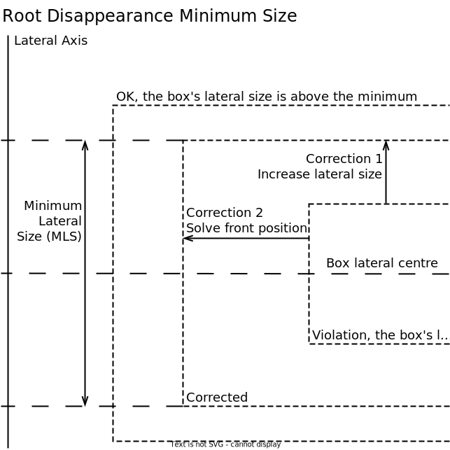
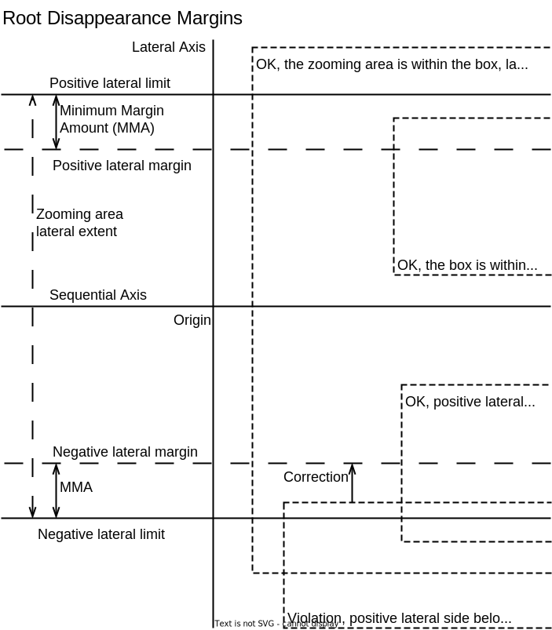
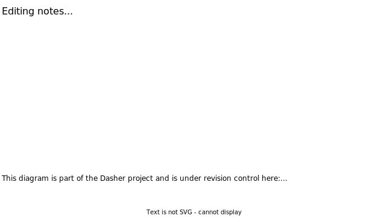

# Zoom Box Movement
This document is part of the Dasher Version Six Specification. It describes how
zoom boxes move in response to the user.

Some terms used here are defined in earlier parts of the specification. See the
[table of contents](../).

# Zoom Box Movement Terms
The movement of zoom boxes is based on continual discrete movements, each
referred to here as a *Zooming Move* or just a move.

A *Zooming Vector Move* is one that is specified in these terms.

-   *Target* zoom box that will move.
-   *Vector* with sequential and lateral amounts by which the target will move.

A *Zooming Destination Move* is one that is specified in these terms.

-   Target zoom box that will move, same as a zooming vector move.
-   *Destination* where the target will be after the move, specified in either
    of these combinations.

    -   Destination lateral centre and destination front position.
    -   Destination lateral centre and destination lateral size.

Any interface that generates zooming moves can be referred to as a
*Zooming Controller*. The Dasher Version Six proof-of-concept implements a 
zooming controller that generates vector moves by tracking the position of a
pointer on the screen. The user can control the pointer by these mechanisms.

-   Using a mouse, trackball, trackpad, or other pointer device.
-   Touching the screen, on a smartphone, tablet or other device that has a
    touch screen.

Controllers are discussed in detail elsewhere in the specification TBD. That
discussion includes

-   how vector or destination values are generated.
-   how a target zoom box is selected.

Zooming moves are processed the same regardless of the type of controller that
generated the move.

# Zooming Move Processing
Processing steps for a single zooming move are as follows.

1.  If the controller has generated a vector move, transform it into a
    destination move. See under **Generate Destination Move from Vector Move**,
    below.

    If the controller has generated a destination move, skip this step.

2.  Finalise the target's destination position and size, *TPS*. Finalisation
    processing depends on what is specified in the destination move.

    If the move specifies a front position then generate a lateral size by
    invoking the solve lateral size function. Vice versa, if the move specifies
    a lateral size then generate a front position by invoking the solve front
    position function.

    Solving functions are described in
    the [Zooming Solver](../04ZoomingSolver/ZoomingSolver.md) section.

3.  Generate an initial destination root box position and size, *IPS*. IPS is
    defined by being consistent with the target having TPS. See under
    **Generate Root Destination from Target Destination**, below.

    Put another way, generate IPS such that the cascade TBD would result in the
    target zoom box being at TPS.

    Note that generation of a root destination can include replacement of the
    root zoom box. If it does then the destination applies to the new root.

4.  Prevent disappearance of the root zoom box from the zooming area in the user
    interface. See under **Root Disappearance Prevention**, below.

    There will be a final root box position and size, *FPS*, that ensures the
    root box doesn't disappear. These are the possible outcomes.

    -   The root destination is *unchanged* so FPS is the same as IPS.
    -   The root box destination applies with modification, referred to here as
        an *override*, so FPS is different to IPS.
    -   The root box destination is *blocked*. That could happen if, for
        example, the root box was on the edge of the zooming area.

    In the blocked case, no further processing takes place. Otherwise processing
    continues to the next step.

5.  Update the root box to FPS and cascade the update down the zooming
    hierarchy. See under **Update Cascade**, below.

    The cascade can result in boxes being added and removed from the zooming
    hierarchy.
    
    The update cascade could have either of these outcomes.

    -   A *root descent box* was identified.
    -   The cascade *finished* without a root descent box being identified.

6.  If a root descent box was identified by the update cascade, process root
    descent now.

    Root descent is described elsewhere in the specification TBD but it could be
    [Zoom Box Spawning](../06ZoomBoxSpawning/ZoomBoxSpawning.md). For
    convenience, some outcomes of root descent are described here.

    -   The current root box, and any intermediate parent boxes between it and
        the root descent box, are removed from the hierarchy.
        
        The removed boxes could be cached and needn't be deleted as such. They
        may be added back to the hierarchy later, if root ascent takes place.
        
        The child boxes of any removed root and parent boxes, other than the new
        root box, may be deleted or cached.

    -   The root descent box becomes the root of the hierarchy.

    Root descent is a resource management type of activity.

    There is no need to cascade an update to the new descended root because that
    will have been processed already.

That concludes the processing for one zoom box move.

## Zooming Move Processing Diagram
This diagram illustrates where in the hierarchy the different stages of zooming
move processing take place.

<picture>
    <source
        media="(prefers-color-scheme: dark)"
        srcset="MoveProcessing_exported-dark.svg" >
    
</picture>

Key

-   Generation of a destination move from a vector move takes place in the
    target, T, if necessary.
-   Finalisation of the target destination position and size takes place in the
    target, T.
-   Generation of an initial root box destination position and size takes place
    in the target, T, and in the parents, P, and in the root, R.
-   Preventing disappearance of the root takes place in the root, R.
-   The update cascade takes place in all boxes, R, P, T, and C.

# Generate Destination Move from Vector Move
Generating a zooming destination move from a zooming vector move is a possible
Zooming Move Processing step, see above.

This example move vector and target are used to illustrate the processing.

Object      | Attribute            | Original Value
------------|----------------------|---------------
Target      | Front position       | 100
Target      | Lateral centre       | 200
Target      | Lateral size         | 150
Move vector | Sequential component | -30
Move vector | Lateral component    | -20

Add the vector's sequential and lateral components to the target's front
position and lateral centre to generate destination values.

Object | Attribute      |Original|Destination
-------|----------------|--------|-----------
Target | Front position | 100    | 70
Target | Lateral centre | 200    | 180

Take those values and the target zoom box as a zooming destination move. In this
case a destination front position has been specified.

# Generate Root Destination from Target Destination
Generating a root destination from a target destination is a Zoom Box Move
Processing step, see above.

A target destination will have been finalised already in these terms.

-   Target zoom box.
-   Destination lateral size and front position.
-   Destination lateral centre.

Processing here is illustrated with a continuation of the example values from
the previous description in the Generate Destination Move from Vector Move
processing, above. Also shown here is an assumed value for the destination
lateral size as mapped from the destination front position by the solver, see
Zooming Move Processing step 2, above.

Object | Attribute      |Original|Destination
-------|----------------|--------|-----------
Target | Lateral centre |        | 180
Target | Front position |        | 70
Target | Lateral size   | 150    | 180

(The zooming solver isn't discussed here but moving in the reverse sequential
direction will increase lateral size.)

Processing steps to generate a root destination from a target destination are as
follows.

1.  If the target is the root of the zoom box hierarchy then check if the root
    ascent conditions are met.

    Root ascent is described elsewhere in the specification TBD but it could be
    [Zoom Box Spawning](../06ZoomBoxSpawning/ZoomBoxSpawning.md). For
    convenience, the conditions are these.
    
    -   The zooming area limits aren't entirely within the root box's formal
        representation.
    -   Either there is at least one stored box from a previous root descent, or
        a new parent box can be synthesised from the target.

    (There won't be a stored box if the target is the original root with empty
    box text. Parent synthesis is described elsewhere in the specification TBD
    but also won't be possible if the target box text is empty.)

    These are some outcomes of root ascent, if it takes place.

    -   The previously stored parent of the target, or a synthesised new parent,
        will be added to the zooming hierarchy as the root.
    -   The target box will be a child of the new root.
    -   Siblings of the target box will have been weight spawned. Weight
        spawning is described elsewhere in the specification TBD but it could be
        [Zoom Box Spawning](../06ZoomBoxSpawning/ZoomBoxSpawning.md).

    Whether the root ascent conditions were met or not, processing continues to
    the next step.

2.  If the target is the root of the zoom box hierarchy, skip the remaining
    steps. The root destination is the target destination.

    Note that if the target was the root at the start of root destination
    generation then it could only be the root now if the root ascent conditions
    weren't met in the previous step.

    If the target isn't the root then continue to the next step. The parent box
    of the target is referred to as the *parent* in the next steps.

3.  Calculate the parent's destination lateral size based on the target's child
    weight and destination lateral size.
    
    Object | Attribute    |Original|Destination
    -------|--------------|--------|-----------
    Target | Child weight | 0.1    |
    Target | Lateral size |        | 180
    Parent | Lateral size | 1500   | 1800

    The parent lateral size is an example for the purposes of illustration. For
    ease of reading, child weight has been normalised here. In detail, the
    target child weight could be one, for example, which means the sum of all
    its siblings' child weights would be ten. The parent's original lateral size
    is included for completeness and isn't a factor in the calculation.

5.  Calculate the parent's destination lateral centre.

    1.  Sum the weights of the target's siblings that are before it in the
        parent to generate a result *W1*. Note that W1 would be zero if the
        target is the first child.
    2.  Sum the weights of the target and all its siblings to generate a result
        *W2*.
    3.  Calculate a destination lateral offset, *DLO*, by multiplying the
        parent's destination lateral size, *DLS*, by W1, then dividing the
        result by W2.
        
        As a formula `DLO = (DLS × W1) ÷ W2`.

    4.  Calculate the destination lateral edge, *DLE*, as the sum of these
        factors.
    
        -   The target's lateral centre, *TLC*.
        -   The target's lateral size, *TLS*, divided by two.
        -   DLO.

        As a formula `DLE = TLC + (TLS ÷ 2) + DLO`
    
    5. Deduct half the DLS from DLE.

    The result is the parent's destination lateral centre.
    
    Object or objects          | Attribute            |Original|Destination
    ---------------------------|----------------------|--------|-----------
    Target                     | Lateral centre       |        | 180
    Target                     | Lateral size         |        | 180
    Parent                     | Lateral size         |        | 1800
    Siblings before the target | Sum of child weights |    0.2 |
    Parent                     | Lateral centre       |   -175 | -270

    The sum of child weights is an example for the purposes of illustration. For
    ease of reading, child weight has been normalised here. In the terms used in
    the calculation, above, W2 is one.

    The parent destination lateral centre calculation in full is as follows.  
    `180 + (180 ÷ 2) + (1800 × 0.2) - (1800 ÷ 2) = -270`

    (Note that child weights don't change after spawning. That means the sum of
    the weights of the siblings before each child need only be calculated once,
    at weight spawning time. That and use of normalised weights are possible
    optimisations for implementation.)

6.  Calculate the parent's destination front position by invoking the solve
    front position function passing in its destination lateral size.

    Destination front position will be needed for the root descent determination
    step in the next iteration.

    This processing step is similar to **Zooming Move Processing** step 2,
    above. The destination lateral size of a moving zoom box is given by a value
    returned by a solver function.

    Object      | Attribute      |Original|Destination
    ------------|----------------|--------|-----------
    Parent      | Lateral size   |        | 1800
    Parent      | Front position | -1250  | -1550

    As before, the mapped size has been assumed for the purposes of
    illustration. The value is consistent with a square solver type of
    algorithm; the change in front position is the same as the change in the
    lateral size.

7.  Taking the parent destination as the target destination repeat the
    processing steps above.

    In effect, processing ascends the hierarchy until the root is reached and
    its destination has been calculated.

That concludes the description of generating a root destination from a target
destination. Note that the actual processing finishes in step 2, after a number
of iterations.

# Root Disappearance Prevention
Prevention of disappearance of the root box is a Zooming Move Processing step,
see above.

Disappearance of the root box is prevented by restricting its size and position.
These restrictions are applied.
    
-   The root box has a minimum lateral size, *MLS*.
-   One or more of these conditions must be true, based on the root box's formal
    representation.
    -   The root box is entirely within the zooming area, laterally.
    -   The zooming area is entirely within the root box, laterally.
    -   A minimum margin amount, *MMA*, of the root box is laterally within the
        zooming area.

Minimum values could be expressed as absolute values, or as formulas based on
the size of the zooming area, or both. MMA could be the same as MLS.

These terms are used with these meanings here.

-   There are two zooming area limits in the lateral dimension, the 
    *positive lateral limit* and the *negative lateral limit*. The positive
    lateral limit has a higher value in the lateral dimension than the negative
    lateral limit.
    
    In the Dasher Version Six proof-of-concept (PoC), for example, the positive
    lateral limit is the top of the zooming area and the negative lateral limit
    is the bottom. In the PoC the origin's vertical position is always the
    centre of the zooming area. So if the positive lateral limit is Y then the
    negative lateral limit is minus Y.

-   There are two zooming area margins in the lateral dimension. Each margin has
    a value in the lateral dimension only.

    The value of one margin, the *positive lateral margin*, is calculated by
    deducting MMA from the positive lateral limit.

    The value of the other margin, the *negative lateral margin*, is calculated
    by adding MMA to the negative lateral limit.

-   Each zoom box has two sides in the lateral dimension. Each side has a
    value in the lateral dimension only.
    
    The value of one side, the *positive lateral side*, is calculated by adding
    half the box's lateral size to its lateral centre.

    The value of the other side, the *negative lateral side*, is calculated by
    deducting the box's lateral size from the positive lateral side.

All those defined values are signed numbers. For illustrative diagrams, see
below the processing steps.

The distances of the limits and sides from the zooming area origin isn't
relevant to the processing here.

Root disappearance prevention takes place after the root destination has been
calculated. The root destination will have these values.

-   Front position and lateral size.
-   Lateral centre.

Processing is as follows.

1.  Check if the root destination lateral size is below MLS. If it is then
    override the size to MLS instead.
    
2.  If the root destination's lateral size was overridden in the previous step
    then override its front position too. Generate the override value by
    invoking the solve front position function passing in the new lateral size.

    The zooming solver is described elsewhere in the specification, see
    [Zooming Solver](../04ZoomingSolver/ZoomingSolver.md).

3.  If the positive lateral side of the root destination has a lower value than
    the positive lateral limit, and the negative lateral side has a higher value
    than the negative lateral limit, then root disappearance prevention
    processing is complete and the remaining steps are skipped.

4.  If the positive lateral side of the root destination has a higher value than
    the positive lateral limit, and the negative lateral side has a lower value
    than the negative lateral limit, then root disappearance prevention
    processing is complete and the remaining steps are skipped.

5.  Calculate the root destination's positive marginal visibility, *PMV*, by
    deducting its positive lateral side value from the negative lateral margin
    value. If PMV is more than zero then the MMA restriction has been broken.

    Adjust the root destination's position by adding PMV to its lateral centre.
    That adjustment will enforce the MMA restriction and the remaining steps are
    skipped.

    Otherwise, if PMV is less than or equal to zero, continue to the next step.

6.  Calculate the root destination's negative marginal visibility, *NMV*, by
    deducting its negative lateral side value from the positive lateral margin
    value. If NMV is less than zero then the MMA restriction has been broken.

    Adjust the root destination's position by adding NMV to its lateral centre.
    That adjustment will enforce the MMA restriction and the remaining steps are
    skipped.

    Otherwise, if NMV is greater than or equal to zero, the MMA restriction
    hasn't been broken.

That concludes prevention of disappearance of the root box.

## Root Disappearance Prevention Diagrams
These diagrams illustrate the root disappearance prevention limits and
processing, see above.

<picture>
    <source
        media="(prefers-color-scheme: dark)"
        srcset="RootDisappearanceSize_exported-dark.svg" >
    
</picture>

This diagram illustrates root disappearance minimum lateral size processing.

-   One box is in violation of the disappearance conditions.
-   The necessary corrections are shown.

<picture>
    <source
        media="(prefers-color-scheme: dark)"
        srcset="RootDisappearanceMargins_exported-dark.svg" >
    
</picture>

That diagram illustrates root disappearance prevention margins.

-   One box is in violation of the disappearance conditions.
-   The necessary correction is shown.

# Update Cascade
The update cascade is a Zooming Move Processing step, see above.

The update cascade for a move starts at the root box, and then repeats in each
of the root box's child boxes, and then in their child boxes recursively until
the whole hierarchy has been updated. Each repetition, referred to here as an
*individual cascade*, is applied downwards from a reference box, referred to
here as the *cascade parent*. In those terms, the first cascade parent is the
root box.

Zoom box spawning and deletion can take place during the cascade. That is
introduced in context in the description here, and detailed elsewhere in the
specification TBD but it could be
[Zoom Box Spawning](../06ZoomBoxSpawning/ZoomBoxSpawning.md).

An individual cascade can have one of these outcomes.

-   The cascade reaches the bottom of the hierarchy and all boxes under the
    parent, directly or indirectly, have been updated so the cascade is
    *finished*.

-   A *root descent* box was identified, either the cascade parent itself or a
    box somewhere in the hierarchy under it. In that case the update may only
    have been applied to boxes in the hierarchy under the root descent box, and
    to the root descent box itself. Siblings of the root box and their
    hierarchies may not have been updated.

    Root descent box identification is described in context in the processing
    steps, below. Root descent itself is described elsewhere in the
    specification TBD but it could be
    [Zoom Box Spawning](../06ZoomBoxSpawning/ZoomBoxSpawning.md).

Processing of an individual cascade takes place after the size and position of
the cascade parent have been updated. Steps are as follows.

1.  Check whether the cascade parent now meets the child deletion conditions.

    Child deletion is described elsewhere in the specification TBD but it could
    be [Zoom Box Spawning](../06ZoomBoxSpawning/ZoomBoxSpawning.md). For
    convenience, the conditions are that the cascade parent is entirely outside
    the zooming area limits.

    If the conditions are met then process child deletion now and skip the remaining steps. This cascade is finished.

    If the child deletion conditions aren't met then continue to the next step.

2.  Check whether the cascade parent meets the child spawning conditions.

    Child spawning is described elsewhere in the specification TBD but it could
    be [Zoom Box Spawning](../06ZoomBoxSpawning/ZoomBoxSpawning.md). For
    convenience, the conditions are that

    -   the box has no child boxes.
    -   all or part of the box is inside the zooming area limits.
    -   the box's lateral size can be calculated and is above a configured
        child spawning threshold.

    If the conditions are met, process child spawning now before continuing to
    the next step. The spawned boxes will each have a child weight.

    >   For now, the specification has something called two-stage spawning but
    >   that will be changed. Also, ignore anything there that suggests
    >   recursive spawning.
    
    If the conditions aren't met then continue to the next step without
    spawning.

3.  Update the lateral size of each child box. Processing is as follows.

    1.  Calculate the sum of all the child weights to generate the cascade
        parent's total weight, *TW*.
    
    2.  Calculate the parent's lateral size divided by TW to give a unit lateral
        size, *ULS*.

    3.  For each child box, set the child box's lateral size as ULS multiplied
        by its child weight.

    Child weights don't change after spawning. That means the total weight need
    only be calculated once for each parent box.

    The sum of child lateral sizes will equal the parent lateral size.

    Note that the dimensions of the child boxes before the update aren't part of
    the calculation. That means they needn't have been calculated during child
    spawning, for example.

4.  Update the lateral centre of each child box.

    1.  Add half the parent lateral size to the parent lateral centre to
        generate a working lateral edge *WLE*.

    2. Repeat the remaining steps for each child N starting at the first child
       and continuing to the last child ...
    
    3.  Add half the lateral size of child N to WLE to generate the new
        lateral centre of child N.
    
    4.  Increment WLE by the lateral size of the child N.

    The child boxes will now laterally fill the cascade parent with no gaps and
    no overlapping.

5.  Update the front position of each child box.

    For each child box, set the front position by invoking the solve front
    position function and passing in the child box's lateral size.

    Solving functions are described in
    the [Zooming Solver](../04ZoomingSolver/ZoomingSolver.md) section.

6.  Check if one of the cascade parent's child boxes meets the root descent
    conditions.

    Root descent is described elsewhere in the specification TBD but it could be
    [Zoom Box Spawning](../06ZoomBoxSpawning/ZoomBoxSpawning.md). For
    convenience, the conditions are that the zooming area limits are entirely
    within the box's formal dimensions.

    Processing could be to check each child box starting with the first one.
    Child boxes don't overlap so it isn't possible for more than one child box
    to meet the root descent conditions. That means if a child box is found that
    does meet the conditions then other boxes needn't be checked.

    If a child box meets the root descent conditions then

    -   start a new update cascade with that child box as the cascade parent.
    -   return the outcome of that cascade as the outcome of this cascade.

    If none of the child boxes meets the root descent conditions then proceed to
    the next processing step.

7.  Initiate individual cascades for the cascade parent's child boxes.

    1.  Select a child box and process an update cascade in which that box is
        the cascade parent.
    2.  If the outcome of that cascade is that a root descent box was
        identified, then skip the other child boxes.
    3.  Otherwise continue with the next child box that hasn't had an update
        cascade.
    4.  Continue until either all child boxes have finished or a root descent
        box was identified by a child cascade.
    
    If a root descent box was identified, return that as the outcome of this
    cascade. Otherwise, if all child cascades finished, proceed to the next
    processing step.

    Child boxes could be selected in their index order. However, selecting child
    boxes that are most likely to have a root descent outcome first could be an
    optimisation here.

8.  Check if the cascade parent itself meets the root descent conditions.

    If it does then the outcome of this cascade is that the cascade parent is
    the root descent box.

    Otherwise the outcome is that the cascade has finished.

That concludes update cascade processing.

# Zoom Box Movement Upward Cascade OBSOLETE

>   Move these tables into the diagrams section and maybe rename it like worked
>   example.

An upward cascade is a step in zoom box movement processing, see above.
Processing here is illustrated with a continuation of the example values from
the previous description.

An upward cascade is processed in relation to a reference box, referred to in
this description as the target. The target's size and position will have been
updated prior to cascade processing.

5.  Update the target's siblings' lateral sizes based on their child weights and
    the parent's updated lateral size.

    Object      | Attribute    |Original|Updated
    ------------|--------------|--------|-------
    Parent      | Lateral size |        | 1800
    Sibling 1   | Child weight | 0.2    |
    Sibling 1   | Lateral size | 300    | 360
    Sibling 2   | Child weight | 0.08   |
    Sibling 2   | Lateral size | 120    | 144
    Sibling ... |              |        |

    The sibling values are examples for the purposes of illustration. Only two
    siblings have been shown. In a typical zoom box there would be up to 25 in a
    hierarchical palette, or around 70 in a flat palette.

6.  Update the target's siblings' lateral centres so that they fill the parent's
    updated lateral size with no gaps and no overlapping, as they would have
    been before move processing started. The calculations can be like this.

    1.  Calculate the sum of the adjusted lateral sizes of all the target's
        siblings that are before it in the parent to generate a result R1. Note
        that R1 could be zero, if the target is the first child.
    2.  Calculate R1 plus half the updated lateral size of the target to
        generate a result R2.
    3.  Calculate R2 plus the updated lateral centre of the target to generate a
        new parent lateral edge (PLE).
    4.  Calculate PLE minus half the updated lateral size of the parent's first
        child to generate a result R3.
    5.  Update the first child's lateral centre to R3.
    6.  Decrement PLE by the updated lateral size of the first child.
    7.  Repeat the calculation from step 4 but with the second child, then the
        third child, and so on until all the target's siblings have had their
        lateral centres updated.

    Note that the target's lateral centre won't change in the above
    calculations.

    Object      | Attribute      |Original|Updated
    ------------|----------------|--------|-------
    Sibling 1   | Lateral size   |        | 360
    Sibling 1   | Lateral centre | 425    | 450
    Target      | Lateral size   |        | 180
    Target      | Lateral centre |        | 180
    Sibling 2   | Lateral size   |        | 144
    Sibling 2   | Lateral centre | 65     | 18
    Sibling ... |                |        |

    In this example, Sibling 1 is the first child of the target's parent, the
    target is the second, and Sibling 2 is the third. Further siblings aren't
    shown.

7.  Update the siblings' front positions by invoking the solve front position
    function passing in each of their updated lateral sizes.

    Object      | Attribute      |Original|Updated
    ------------|----------------|--------|-------
    Sibling 1   | Lateral size   |        | 360
    Sibling 1   | Front position | -50    | -110
    Sibling 2   | Lateral size   |        | 144
    Sibling 2   | Front position | 130    | 106
    Sibling ... |                |        |

    As before, the mapped sizes have been assumed for the purposes of
    illustration. These values are consistent with a square solver type of
    algorithm.

8.  Update the target's parent's lateral centre based on its updated lateral
    size and its first child's updated lateral centre and size. The calculations
    can be like this.

    1.  Calculate the first child's updated lateral centre plus half the first
        child's updated lateral size to generate the Parent Lateral Edge (PLE).
    2.  Calculate PLE minus half the parent's updated lateral size to generate
        the parent's updated lateral centre.

    Object      | Attribute      |Original|Updated
    ------------|----------------|--------|-------
    Sibling 1   | Lateral size   |        | 360
    Sibling 1   | Lateral centre |        | 450
    Parent      | Lateral size   |        | 1800
    Parent      | Lateral centre | -175   | -270

    The calculation is like this.

        PLE = Sibling 1 lateral centre + ( Sibling 1 lateral size / 2 )
            = 630
        Parent lateral centre = PLE - ( Parent lateral size / 2 )
                              = 630 - 900

# Zoom Box Movement Processing Diagrams
These diagrams illustrate the examples in the processing steps, above.

>   Jim, do new diagrams.

Zoom boxes are shown as three-sided rectangles.

Updates in each step are shown by

-   solid lines for zoom boxes as they are at the start of the step.
-   dashed lines for the end of the step.

Dotted lines

-   with arrows and numbers indicate size and position values.
-   without arrows indicate lateral centres of zoom boxes for the purposes of
    showing lateral size in two halves or for showing lateral position.

In steps where a lateral size is changed, the updated box is shown with the same
lateral centre. There will be a later step in which lateral position also
changes.

Each diagrams is drawn to a scale that best shows the update in the
corresponding processing step. This means that the diagrams are at different
scales.

The first diagram illustrates the starting positions and some sizes.

<picture>
    <source
        media="(prefers-color-scheme: dark)"
        srcset="MoveProcessing00_exported-dark.svg" >
    
</picture>

<picture>
    <source
        media="(prefers-color-scheme: dark)"
        srcset="MoveProcessing01_exported-dark.svg" >
    
</picture>

<picture>
    <source
        media="(prefers-color-scheme: dark)"
        srcset="MoveProcessing02_exported-dark.svg" >
    
</picture>

<picture>
    <source
        media="(prefers-color-scheme: dark)"
        srcset="MoveProcessing03_exported-dark.svg" >
    
</picture>

<picture>
    <source
        media="(prefers-color-scheme: dark)"
        srcset="MoveProcessing04_exported-dark.svg" >
    
</picture>

<picture>
    <source
        media="(prefers-color-scheme: dark)"
        srcset="MoveProcessing05_exported-dark.svg" >
    
</picture>

<picture>
    <source
        media="(prefers-color-scheme: dark)"
        srcset="MoveProcessing06_exported-dark.svg" >
    
</picture>

<picture>
    <source
        media="(prefers-color-scheme: dark)"
        srcset="MoveProcessing07_exported-dark.svg" >
    
</picture>

<picture>
    <source
        media="(prefers-color-scheme: dark)"
        srcset="MoveProcessing08_exported-dark.svg" >
    
</picture>

# Next Section
The next section in the specification is TBD.

See also the [table of contents](../).

# Document Information
This document is part of the Dasher project and is under revision control here:  
[https://github.com/dasher-project/dasher-web](https://github.com/dasher-project/dasher-web)

(c) 2023 The ACE Centre-North, UK registered charity 1089313.  
MIT licensed, see [https://opensource.org/licenses/MIT](https://opensource.org/licenses/MIT)
