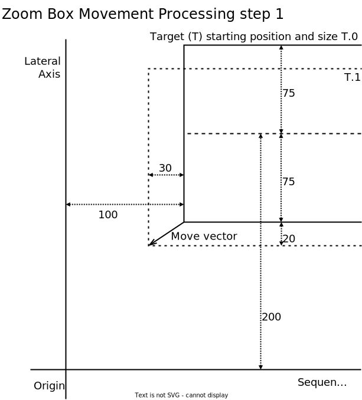
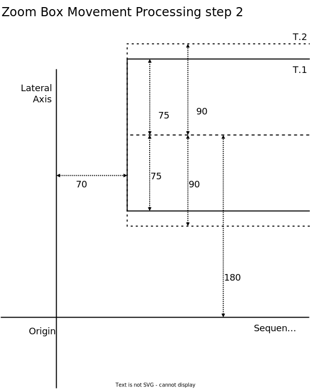

# Zoom Box Movement
This document is part of the Dasher Version Six Specification. It describes how
zoom boxes move in response to the user.

Some terms used here are defined in earlier parts of the specification. See the
[table of contents](../).

# Zoom Box Movement Terms
The movement of zoom boxes is based on continual discrete movements, each
referred to here as a *Zooming Move* or just a move.

A zooming move can be described in the following terms.

-   Each move has a *Vector* with sequential and lateral dimensions.
-   Each move has a *Target* zoom box.

Interfaces that generate zooming moves can be referred to as
*Zooming Controllers*. The Dasher Version Six proof-of-concept implements a
zooming controller that generates moves by tracking the position of a pointer on
the screen. The user can control the pointer by these mechanisms.

-   Using a mouse, trackball, trackpad, or other pointer device.
-   Touching the screen, on a smartphone, tablet or other device that has a
    touch screen.

Controllers are discussed in detail elsewhere in the specification. That discussion includes

-   how vector values are generated.
-   how a target zoom box is selected.

Zooming moves are processed the same regardless of the type of controller that
generated the move.

# Zoom Box Movement Processing Steps
The user interface processing for each move is described below as a sequence of
steps.

This example move vector and target are used to illustrate the processing.

Object      | Attribute            | Original Value
------------|----------------------|---------------
Target      | Front position       | 100
Target      | Lateral centre       | 200
Target      | Lateral size         | 150
Move vector | Sequential component | -30
Move vector | Lateral component    | -20

The description of each step includes a list of updated attributes. Further
objects are added to the example as required for illustration.

Processing steps are as follows.

1.  Add the vector's sequential and lateral components to the target's front
    position and lateral centre.

    Object | Attribute      |Original|Updated
    -------|----------------|--------|-------
    Target | Front position | 100    | 70
    Target | Lateral centre | 200    | 180

2.  Update the target's lateral size by invoking the solve lateral size
    function passing in its front position.

    Object | Attribute      |Original|Updated
    -------|----------------|--------|-------
    Target | Front position |        | 70
    Target | Lateral size   | 150    | 180

    For the purposes of illustration, the mapped size is assumed to be 180. The
    zooming solver isn't discussed here but decreasing front position will
    increase size.

3.  Update the target's parent's lateral size based on the target's child weight
    and new lateral size. This step is the start of the *Parent Update*.

    Object | Attribute    |Original|Updated
    -------|--------------|--------|-------
    Target | Child weight | 0.1    |
    Target | Lateral size |        | 180
    Parent | Lateral size | 1500   | 1800

    The parent lateral size is an example for the purposes of illustration. For
    ease of reading, child weight has been normalised here. In detail, the
    target child weight could be one, for example, which means the sum of all
    its siblings' child weights would be ten.

4.  Update the target's siblings' lateral sizes based on their child weights and
    the parent's updated lateral size.

    Object      | Attribute    |Original|Updated
    ------------|--------------|--------|-------
    Parent      | Lateral size |        | 1800
    Sibling 1   | Child weight | 0.2    |
    Sibling 1   | Lateral size | 300    | 360
    Sibling 2   | Child weight | 0.08   |
    Sibling 2   | Lateral size | 120    | 144
    Sibling ... |              |        |

    The sibling values are examples for the purposes of illustration. Only two
    siblings have been shown. In a typical zoom box there would be up to 25 in a
    hierarchical palette, or around 70 in a flat palette.

5.  Update the target's siblings' lateral centres so that they fill the parent's
    updated lateral size with no gaps and no overlapping, as they would have
    been before move processing started. The calculations can be like this.

    1.  Calculate the sum of the adjusted lateral sizes of all the target's
        siblings that are before it in the parent to generate a result R1. Note
        that R1 could be zero, if the target is the first child.
    2.  Calculate R1 plus half the updated lateral size of the target to
        generate a result R2.
    3.  Calculate R2 plus the updated lateral centre of the target to generate a
        new lateral parent edge (LPE).
    4.  Calculate LPE minus half the updated lateral size of the parent's first
        child to generate a result R3.
    5.  Update the first child's lateral centre to R3.
    6.  Decrement LPE by the updated lateral size of the first child.
    7.  Repeat the calculation from step 4 but with the second child, then the
        third child, and so on until all the target's siblings have had their
        lateral centres updated.

    Note that the target's lateral centre won't change in the above
    calculations.

    Object      | Attribute      |Original|Updated
    ------------|----------------|--------|-------
    Sibling 1   | Lateral size   |        | 360
    Sibling 1   | Lateral centre | 425    | 450
    Target      | Lateral size   |        | 180
    Target      | Lateral centre |        | 180
    Sibling 2   | Lateral size   |        | 144
    Sibling 2   | Lateral centre | 65     | 18
    Sibling ... |                |        |

    In this example, Sibling 1 is the first child of the target's parent, the
    target is the second, and Sibling 2 is the third. Further siblings aren't
    shown.

6.  Update the siblings' front positions by invoking the solve front position
    function passing in each of their updated lateral sizes.

    Object      | Attribute      |Original|Updated
    ------------|----------------|--------|-------
    Sibling 1   | Lateral size   |        | 360
    Sibling 1   | Front position | -50    | -110
    Sibling 2   | Lateral size   |        | 144
    Sibling 2   | Front position | 130    | 106
    Sibling ... |                |        |

    As before, the mapped sizes have been assumed for the purposes of
    illustration. These values are consistent with a square solver type of
    algorithm.

8.  Update the target's parent's lateral centre based on its updated lateral
    size and its first child's updated lateral centre and size.

    Object      | Attribute      |Original|Updated
    ------------|----------------|--------|-------
    Sibling 1   | Lateral size   |        | 360
    Sibling 1   | Lateral centre |        | -50
    Parent      | Lateral size   |        | 1800
    Parent      | Lateral centre | -175   | 670

    The calculation is like this.

        Parent lateral top = Sibling 1 lateral centre - ( Sibling 1 lateral size / 2 )
                           = -230
        Parent lateral centre = Parent lateral top + ( Parent lateral size / 2 )
                              = -230 + 900
                              = 670

9.  Update the parent's front position by invoking the solve front position
    function passing in its updated lateral size. This step is the end of the
    parent update.

9.  Ascend the hierarchy from the parent of the target parent to the root box
    and apply the parent update, steps 3 to 7, to each box.

10. For each box that moved or changed size during the parent update, process a
    *Child Update* as follows.

    -   If the parent already has child boxes
        -   adjust child box sizes and positions based on the updated parent
            size and position.
        -   process child deletion if the box moved outside the zooming area
            limits.
    -   If the parent didn't have child boxes, and increased in size and crossed
        the child spawning threshold, process child spawning.

That completes processing of a zooming move.

# Zoom Box Movement Processing Diagrams
These diagrams illustrate the processing with reference to the processing steps,
above.

<picture>
    <!-- <source
        media="(prefers-color-scheme: dark)"
        srcset="MoveProcessing01_exported-dark.svg" > -->
    
</picture>

# Next Section
The next section in the specification is TBD.

See also the [table of contents](../).

# Document Information
This document is part of the Dasher project and is under revision control here:  
[https://github.com/dasher-project/dasher-web](https://github.com/dasher-project/dasher-web)

(c) 2023 The ACE Centre-North, UK registered charity 1089313.  
MIT licensed, see [https://opensource.org/licenses/MIT](https://opensource.org/licenses/MIT)
