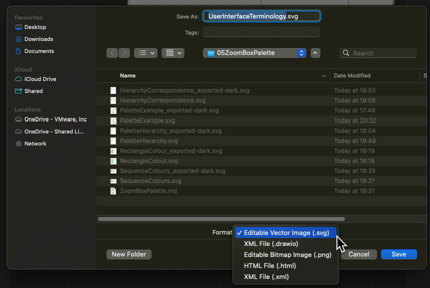
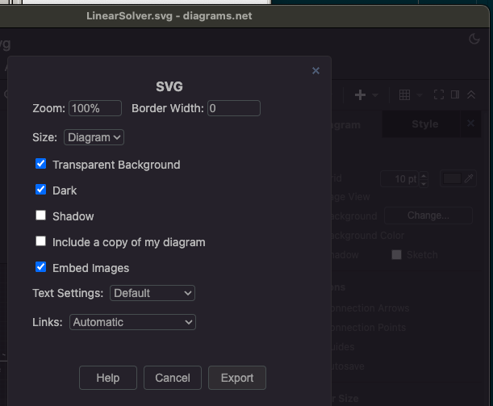
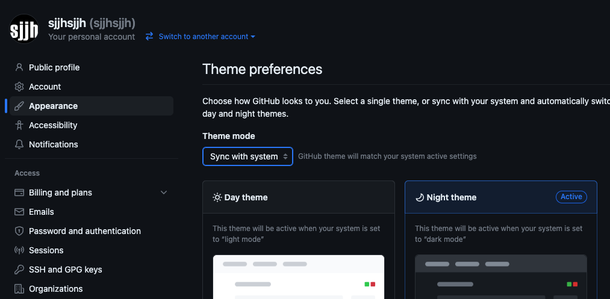
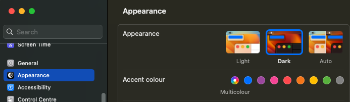

# Editing guide
This guide applies to the Dasher Version Six specification.

The specification is written in Markdown and under revision control on GitHub.
The Markdown contains images, most of which are diagrams.

# Image creaton and editing
The image files in the specification are created and edited with the
[diagrams.net](https://diagrams.net) tool, aka the draw.io tool. The tool has a
desktop app edition, and an unofficial plugin for VSCode and VSCodium.

-   Save images as *editable SVG* files. The tool embeds the image source into
    the SVG. This is preferable to having two files like a .drawio file and then
    exporting to .svg format. However, it seems necessary to export in order to
    support dark mode in GitHub.

    This screen capture shows the correct save-as option in the desktop tool
    for macOS.

    

-   Make diagrams that support dark mode by removing these declarations from the
    style of individual graphic elements.

    -   fontColor
    -   strokeColor

    Or you can set them to `default`. See also this SO question and answer.  
    [https://stackoverflow.com/questions/75950638/automatic-fill-colour-but-opposite-to-theme-in-diagrams-net-aka-draw-io](https://stackoverflow.com/questions/75950638/automatic-fill-colour-but-opposite-to-theme-in-diagrams-net-aka-draw-io)

-   Use the typeface `Verdana` for all fonts. That typeface is included in the
    tool by default and shouldn't require downloading or embedding.

# How to add images with dark mode support
Check these notes for how to add images to the Markdown so that GitHub renders
them correctly in dark mode.

-   Export a dark-mode version of the diagram from the desktop tool.

    Dark mode export is only available if the tool is running in dark mode.

    

    See also this article on their website.  
    [https://www.drawio.com/blog/dark-mode-diagram-editor](https://www.drawio.com/blog/dark-mode-diagram-editor)

    The unofficial plugin edition doesn't have this export feature.

-   Use `<picture>` HTML tags to support dark mode images in GitHub Markdown.

    For example, like this.

        Markdown preamble here.

        <picture>
            <source
                media="(prefers-color-scheme: dark)"
                srcset="PaletteExample_exported-dark.svg" >
            
        </picture>

        Markdown continues here.
    
    That is valid Markdown because the Markdown specification allows all HTML.

    See
    https://docs.github.com/en/get-started/writing-on-github/getting-started-with-writing-and-formatting-on-github/basic-writing-and-formatting-syntax#specifying-the-theme-an-image-is-shown-to
    for official instructions.

-   You can make GitHub load in light or dark mode in Chrome for macOS by
    selecting to synchronise the theme.

    

    Then select light or dark mode in the macOS Settings.

    

    See also https://docs.github.com/en/account-and-profile/setting-up-and-managing-your-personal-account-on-github/managing-personal-account-settings/managing-your-theme-settings

-   You can check which `source` is active in a `picture` by opening the web
    page in the Chrome developer tools and inspecting the `currentSrc` property
    of the `img` HTML element.  
    (TOTH https://stackoverflow.com/a/30900438/7657675)

# Document Information
The Dasher Version Six specification is part of the Dasher project and is under
revision control here:  
[https://github.com/dasher-project/dasher-web](https://github.com/dasher-project/dasher-web)

(c) 2023 The ACE Centre-North, UK registered charity 1089313.  
MIT licensed, see [https://opensource.org/licenses/MIT](https://opensource.org/licenses/MIT)
