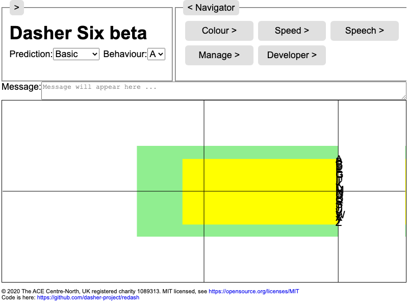

# Dasher in Web Technologies

Base project for Dasher v6 (see also [CaptiveWebView for iOS/Android](https://github.com/dasher-project/dasher-captivewebview), [Electron for Desktop](https://github.com/dasher-project/dasher-electron)).

-   Browser.

    To run the browser proof of concept, go here:
    [https://dasher-project.github.io/dasher-web/browser/](https://dasher-project.github.io/dasher-web/browser/)

-   Keyboard and app for iOS.

    There is an Xcode project for a functional custom keyboard for iOS in the
    [Keyboard](Keyboard) sub-directory. The keyboard is packaged in an app.

-   Keyboard for Android.

    There is a Android Studio project for a functional custom keyboard for
    Android in the [Keyboard](Keyboard) sub-directory.

# Backlog
-  Check out our comprehensive [backlog](documents/Backlog.md), and send us a
request to help out!

# Development
- Read the [developer guides](documents/Development.md) and be sure to check out the [specifications](documents/Specification/readme.md) to better understand the technologies driving Dasher.

# Contributing
-  We'd love your help! Check out our housekeeping [rulebook](documents/Development.md) for best practices
on contributing.

## Versioning
- dasher-web follows [Semantic Versioning](https://semver.org/).

# License
Copyright (c) 2020 The ACE Centre-North, UK registered charity 1089313. MIT
licensed, see
[https://opensource.org/licenses/MIT](https://opensource.org/licenses/MIT).

# Other Versions of Dasher
If you are searching for the older versions of Dasher, you can have a look at https://github.com/dasher-project/dasher/ or https://github.com/dasher-project/dasher-MIT/
